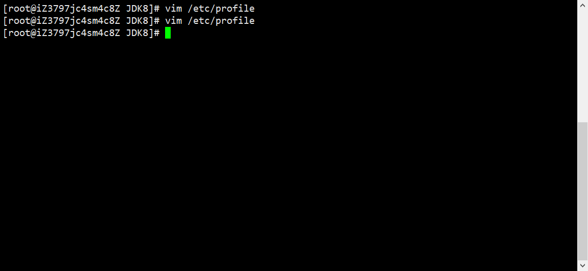

# Centos8装JDK8

## 1.搜索JDK的官网

### https://www.oracle.com/java/technologies/javase/javase-jdk8-downloads.html

## 2.找到以tar.gz结尾的列表

### (1)因为linux一般以tar.gz/tar.xz为压缩文件

### (2)点击找到的地址[需要登录Oracle账号，没有直接注册]

## 3.打开Centos8服务器

### (1)打开/usr/local，新建JDK8文件夹便于查看

#### mkdir JDK8，cd JDK8

### (2)使用wget下载复制的链接

#### wget https://download.oracle.com/otn/java/jdk/8u271-b09/61ae65e088624f5aaa0b1d2d801acb16/jdk-8u271-linux-x64.tar.gz?AuthParam=1609000913_bb69ddff806583cb5e79237229a2fd1e

### (3)下载完毕后查看文件夹结构[使用`ls -lht`查看文件大小]

## 4.解压并安装

### (1)解压

#### tar -xzf  'jdk-8u271-linux-x64.tar.gz?AuthParam=1609000913_bb69ddff806583cb5e79237229a2fd1e'

### (2)配置环境变量

#### vim /etc/profile

#### 在文件最后加上下面代码，按`i`进入`insert`模式

##### JAVA_HOME=/usr/local/JDK8/jdk1.8.0_271

##### PATH=$JAVA_HOME/bin:$PATH

##### CLASSPATH=$JAVA_HOME/jre/lib/ext:$JAVA_HOME/lib/tools.jar

##### export PATH JAVA_HOME CLASSPATH

#### 编辑完成，按`Tab`键底部出现输入框，输入`:wq`回车保存退出

### (3)重新加载系统配置文件

#### source /etc/profile

## 5.测试是否安装成功

### java -version

