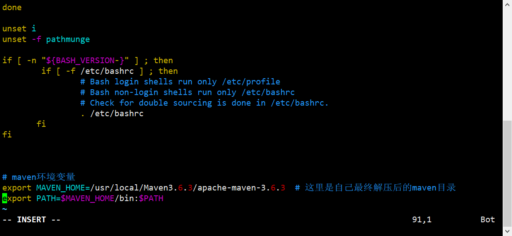

# Centos8装Maven3.6.3

## 1.搜索Maven的官网

### https://maven.apache.org/download.cgi?Preferred=https%3A%2F%2Fftp.jaist.ac.jp%2Fpub%2Fapache%2F

## 2.找到以tar.gz结尾的列表

### (1)因为linux一般以tar.gz/tar.xz为压缩文件

### (2)右键->复制链接

## 3.打开Centos8服务器

### (1)打开/usr/local，新建maven3.6.3文件夹便于查看

#### mkdir maven3.6.3，cd maven3.6.3

### (2)使用wget下载复制的链接

#### wget https://downloads.apache.org/maven/maven-3/3.6.3/binaries/apache-maven-3.6.3-bin.tar.gz

### (3)下载完毕后文件夹结构

## 4.解压并安装

### (1)解压

#### tar -zxvf apache-maven-3.6.3-bin.tar.gz

### (2)配置环境变量

#### vim /etc/profile

#### 在文件最后加上下面代码，按`i`进入`insert`模式

##### export MAVEN_HOME=/usr/local/maven3.6.3/apache-maven-3.6.3  # 这里是自己最终解压后的maven目录

##### export PATH=$MAVEN_HOME/bin:$PATH

#### 编辑完成，按`Tab`键底部出现输入框，输入`:wq`回车保存退出

### (3)重新加载系统配置文件

#### source /etc/profile

## 5.测试是否安装成功

### mvn -v

### ps:注意，这里的maven需要先安装JDK，不然会报找不到JAVA类库！！