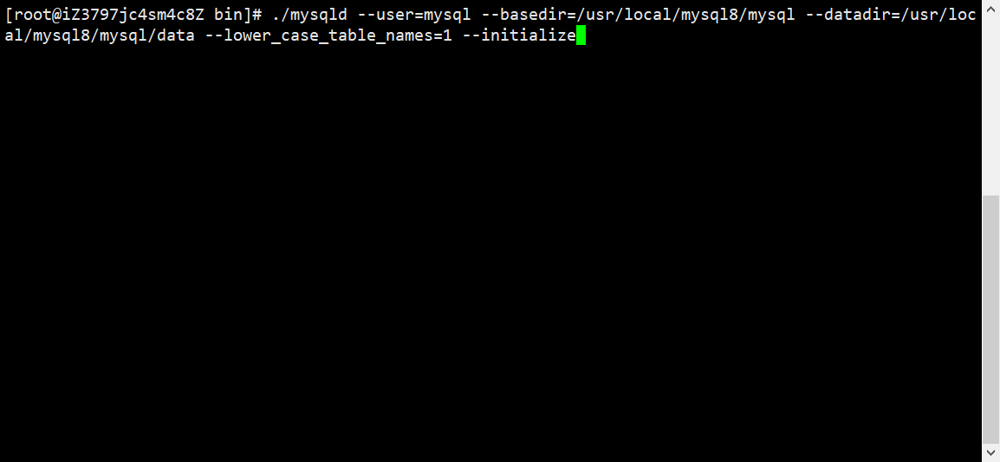
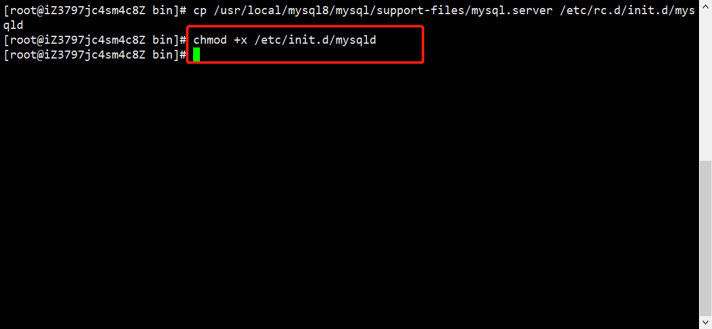

# Centos8装MySql8.0.22

## 1.搜索MySql的官网

### https://dev.mysql.com/downloads/mysql/

## 2.找到以tar.xz结尾的列表

### (1)因为linux一般以tar.gz/tar.xz为压缩文件

### (2)视自己操作系统位数选择，这里选择64位

### (3)选择No，thanks.....，右键-复制链接

## 3.打开Centos8服务器

### (1)打开/usr/local，新建mysql8文件夹便于查看

#### mkdir mysql8，cd mysql8

### (2)使用wget下载复制的链接

#### wget https://dev.mysql.com/get/Downloads/MySQL-8.0/mysql-8.0.22-linux-glibc2.12-x86_64.tar.xz

### (3)下载完毕后查看文件夹结构[使用`ls -lht`查看文件大小]

## 4.解压并安装

### (1)解压

#### tar xvf mysql-8.0.22-linux-glibc2.12-x86_64.tar.xz

### (2)将文件夹重命名mysql

#### mv mysql-8.0.22-linux-glibc2.12-x86_64 mysql

### (3)进入重命名后的文件夹[mysql]，创建一个新文件夹，取名：`data`

#### cd mysql，mkdir data

### (4)创建/etc/my.cnf，先查看是否`存在`

##### cat /etc/my.cnf

##### 不存在再创建该文件

###### vi /etc/my.cnf

### (5)编辑/etc/my.cnf，复制以下内容进去，按`i`进入`insert`模式

#### [mysqld]

#### port=3306

#### basedir=/usr/local/mysql8/mysql    # 这里写自己解压后的mysql目录

#### datadir=/usr/local/mysql8/mysql/data   # 这里写自己解压后的mysql/data目录

#### max_connections=10000

#### max_connect_errors=10

#### character-set-server=UTF8MB4

#### default-storage-engine=INNODB

#### lower_case_table_names=1

#### sql_mode=STRICT_TRANS_TABLES,NO_ZERO_IN_DATE,NO_ZERO_DATE,ERROR_FOR_DIVISION_BY_ZERO,NO_ENGINE_SUBSTITUTION 

#### skip-grant-tables # 无需密码登录

#### 文字说明:

#### (需要修改的地方: 

#### basedir: 使用给定目录作为根目录(安装目录)

#### datadir: 从给定目录读取数据库文件,存储mysql数据文件夹

#### 重要的两个:

#### lower_case_table_names: 值为1,忽略大小写,即查询时候不分大小写(一旦设置并启动后,再更改比较烦,慎重)

#### sql_mode: (sql中select后面的字段必须出现在group by后面，或者被聚合函数包裹，不然会抛出上面的错误,允许使用 GROUP BY 函数)

### (6)编辑完成，按`Tab`键底部出现输入框，输入`:wq`回车保存退出

### (7)创建mysql用户，进行授权(以自己mysql目录为准)

#### groupadd mysql

#### useradd -g mysql mysql

#### chown -R mysql.mysql /usr/local/mysql8/mysql 

#### chmod 755 /usr/local/mysql8/mysql  

#### chmod 644 /etc/my.cnf

### (8)进入mysql的bin目录(以自己mysql目录为准)

#### cd /usr/local/mysql8/mysql/bin 

### (9)生成mysql数据库基础数据

#### ./mysqld --user=mysql --basedir=/usr/local/mysql8/mysql --datadir=/usr/local/mysql8/mysql/data --lower_case_table_names=1 --initialize

### (10)添加mysql服务到系统,并完成授权

#### cd /usr/local/mysql8/mysql

#### cp -a ./support-files/mysql.server /etc/init.d/mysql

#### chmod +x /etc/init.d/mysql

#### chkconfig --add mysql

### (11)mysql启动和查看

#### service mysql start 启动

#### service mysql status 查看

### (12)mysql登录

#### mysql -uroot -p

#### 可能会报以下错误[mysql command not found]，那是因为在/usr/local/bin下缺失mysql导致，建立一个软连接就好

#### cd /usr/local/bin

#### ln -fs /usr/local/mysql8/mysql/bin/mysql mysql

#### 再次输入 mysql -uroot -p

#### mysql登录成功

### (13)修改mysql登录密码

#### ALTER USER 'root'@'localhost' IDENTIFIED WITH mysql_native_password BY '自己的密码';

#### 如果在my.cnf里添加了无需密码的代码，需要去掉然后重启mysql

#### 去除无需密码的代码之后，重启mysql

##### /etc/init.d/mysql restart

#### PS：再次重复修改密码的操作就好了，就不再演示[如果需要输入密码则输入初始化密码]，修改之后输入以下代码

#### flush privileges; (密码生效)

### (14)允许远程连接

#### use mysql;

#### update user set host='%' where user='root';

#### flush privileges;

### (15)设置mysql, 开机自启动

#### 复制mysql安装目录下的mysql.server : cp /usr/local/mysql8/mysql/support-files/mysql.server /etc/rc.d/init.d/mysqld

#### 赋予权限：chmod +x /etc/init.d/mysqld

#### 添加服务: chkconfig --add mysqld

#### 查看服务列表:  chkconfig --list

