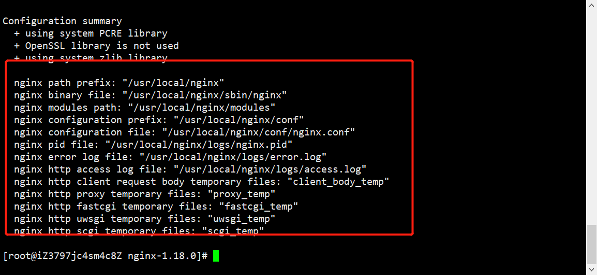
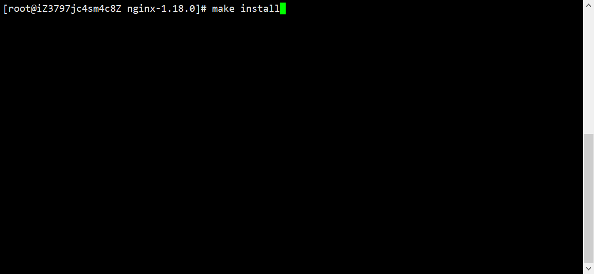
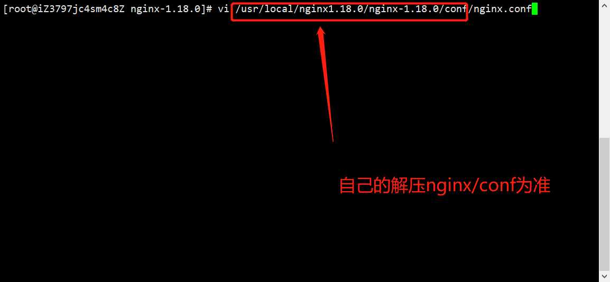
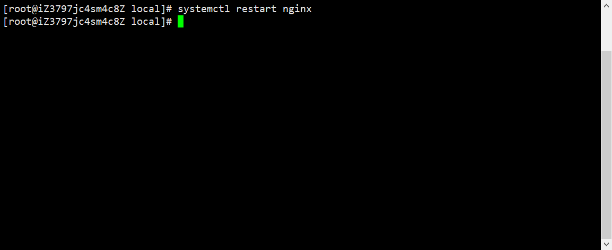

# Centos8装Nginx1.18.0

## 1.搜索Nginx的官网

### http://nginx.org/en/download.html


## 2.找到nginx.1.18.0[Stable version 稳定版]

### (1)因为linux一般以tar.gz/tar.xz为压缩文件


### (2)右键->复制链接


## 3.打开Centos8服务器

### (1)打开/usr/local，新建nginx1.18.0文件夹便于查看

#### mkdir nginx1.18.0，cd nginx1.18.0


### (2)使用wget下载复制的链接

#### wget http://nginx.org/download/nginx-1.18.0.tar.gz


### (3)下载完毕后文件夹结构


## 4.解压和安装其他依赖

### (1)解压

#### tar -xvf nginx-1.18.0.tar.gz


### (2)使用yum安装其他依赖

#### yum -y install gcc zlib zlib-devel pcre-devel openssl openssl-devel

#### 注意：如果安装过就无需安装


## 5.安装Nginx

### (1)进入nginx安装目录

####  cd nginx-1.18.0/


### (2)执行configure命令

#### ./configure --prefix=/usr/local/nginx --with-http_stub_status_module --with-http_ssl_module --with-http_v2_module --with-http_sub_module --with-http_gzip_static_module --with-pcre




### (3)执行make命令

#### make


### (4)执行make install命令

#### make install




## 6.配置nginx.cnf

### (1)打开配置文件

#### vi /usr/local/nginx1.18.0/nginx-1.18.0/conf/nginx.conf




### (2)修改server进行简单配置，按`i`进入`insert`模式


### (3)编辑完成，按`Tab`键底部出现输入框，输入`:wq`回车保存退出


## 7.测试是否安装配置成功

### (1)接上步走，`重启`nginx

#### /usr/local/nginx1.18.0/nginx-1.18.0/sbin/nginx -s reload


#### 发现会报找不到的错误


#### 这是因为在执行./configure命令时，sbin文件是被直接放到了/usr/local/nginx里面


#### 编辑nginx环境变量

##### **vi /etc/profile**


#### 在末尾添加关于nginx的环境变量

##### **export NGINX_HOME=/usr/local/nginx**

##### **export PATH=$PATH:$NGINX_HOME/sbin**


#### 编辑完成，按`Tab`键底部出现输入框，输入`:wq`回车保存退出


#### 让配置生效，输入以下命令

**source /etc/profile**


### (2)设置nginx为系统服务

#### vi /lib/systemd/system/nginx.service


#### 加入以下命令

```html
[Unit]
Description=nginx service
After=network.target 
[Service] 
Type=forking
ExecStart=/usr/local/nginx/sbin/nginx
ExecReload=/usr/local/nginx/sbin/nginx -s reload 
ExecStop=/usr/local/nginx/sbin/nginx -s quit
PrivateTmp=true 
[Install] 
WantedBy=multi-user.target
```


### (3)设置开机自启动

#### systemctl enable nginx


### (4)重启nginx

#### systemctl restart nginx



### (5)访问域名:80测试

#### 出现Welcom to nginx表示成功


