# CentOS8使用yum装NodeJs并升级

## 1.安装NodeJs

### (1)使用EPEL安装

#### yum info epel-release

#### 查看是否安装了epel-release包，以下情况说明已安装

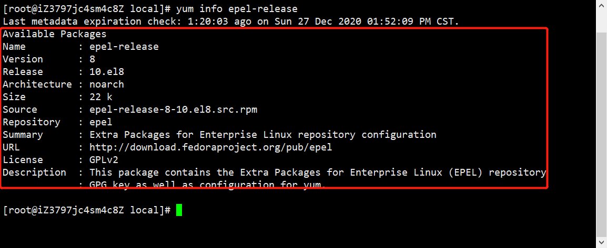

#### 如果没有的话，则输入yum install epel-release进行安装

### (2)使用yum安装NodeJs

#### sudo yum install nodejs

#### 如果需要输入y/N的输入`y`

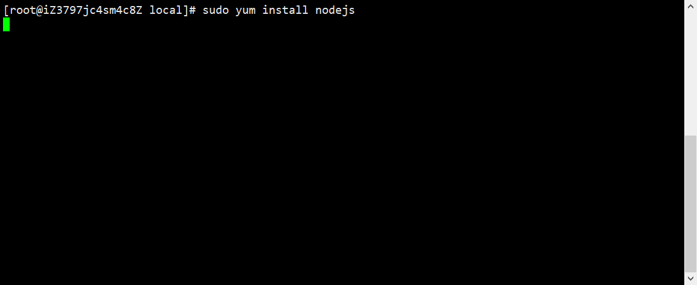

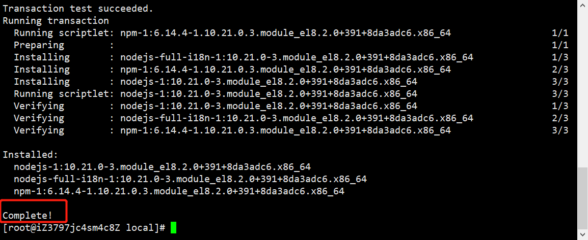

### (3)验证是否安装成功

#### node -v

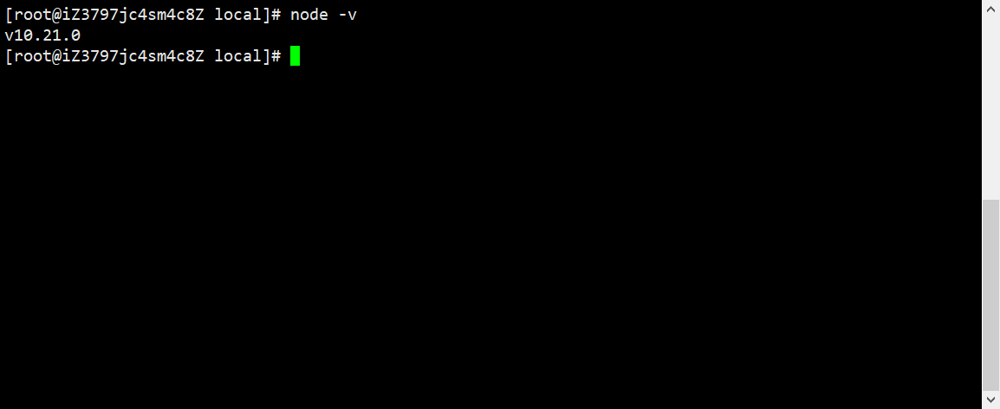

### (附加)如果有安装了nodejs但是需要升级看下面操作

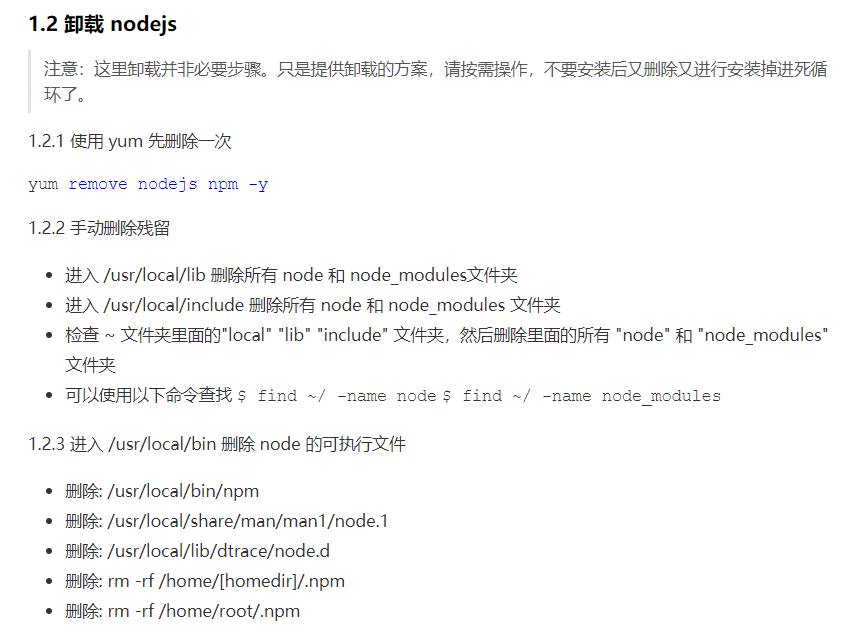

## 2.升级NodeJs

### (1)安装n

#### npm install -g n

#### n是nodejs管理工具，是TJ写的，Github: https://github.com/tj/n

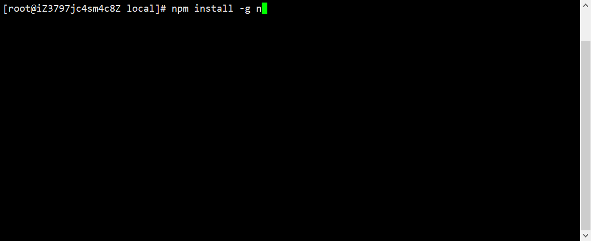

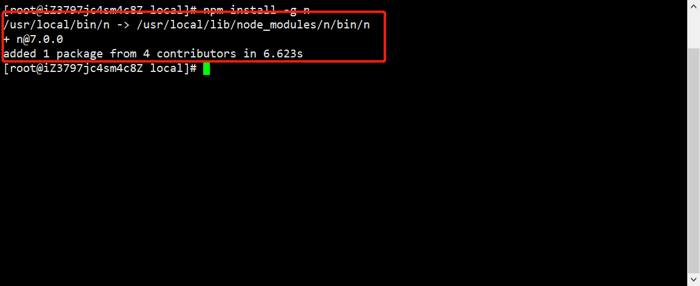

### (2)安装NodeJs最新版本

#### n latest 安装最新版本

#### n 8.11.3 安装指定版本 

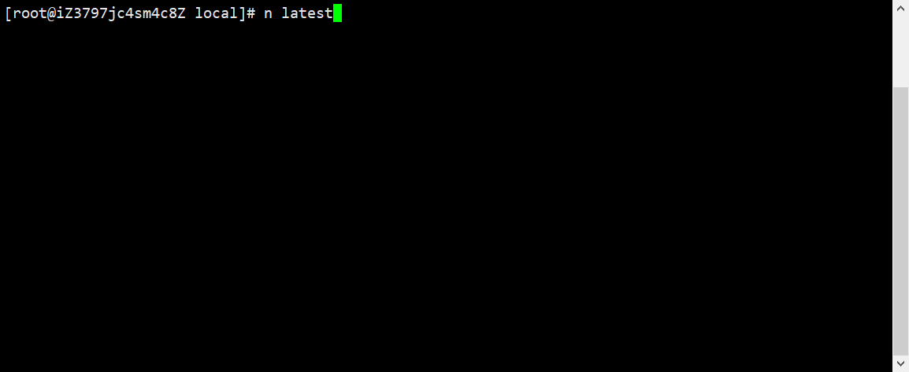

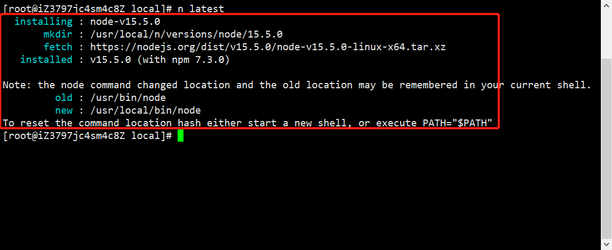

### (3)切换NodeJs版本

#### n

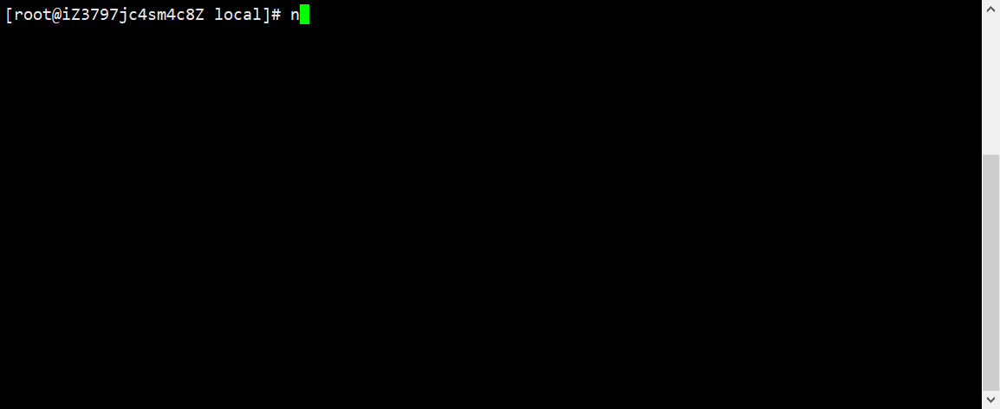

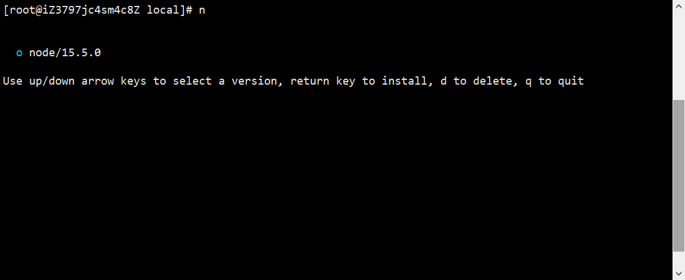

#### 如果只有一个版本的，则直接回车，反之就按`上下`键选择后`回车`

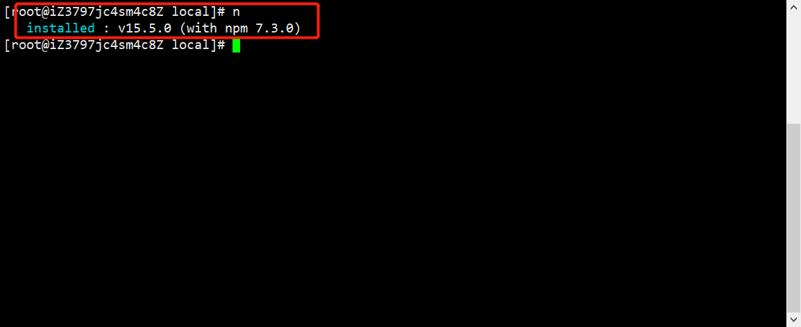

#### 再次查看NodeJs的版本

##### **node -v**

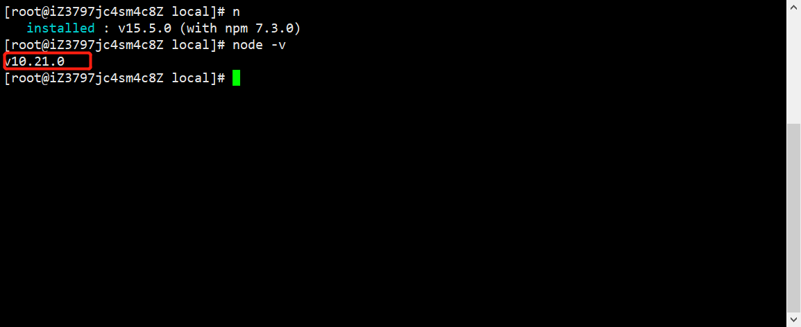

#### 发现还是原来的版本，怎么办呢？看下面操作

### (4)切换失效的解决办法

#### 查看node当前安装路径

##### **which node**

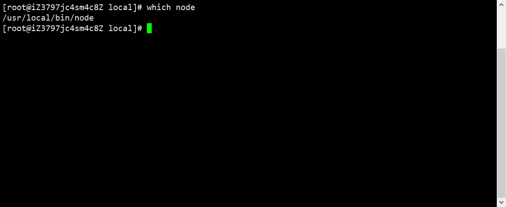

#### n 默认安装路径是 /usr/local，若你的 node 不是在此路径下，n 切换版本就不能把bin、lib、include、share 复制该路径中，所以我们必须通过N_PREFIX变量来修改 n 的默认node安装路径。

#### 编辑环境配置文件

##### **vim ~/.bash_profile**

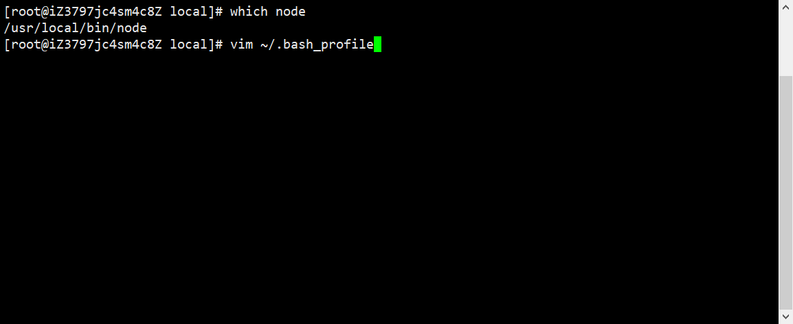

#### 将以下代码放置于末尾

```
export N_PREFIX=/usr/local #node实际安装位置
export PATH=$N_PREFIX/bin:$PATH
```

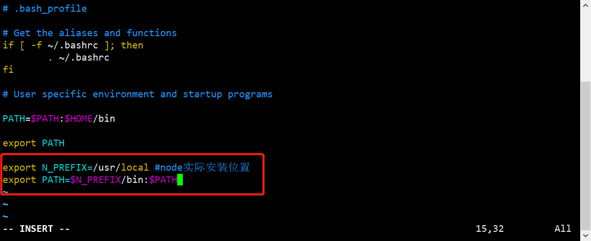

#### 按`Tab`键之后，输入`:x`或`:wq`回车保存退出

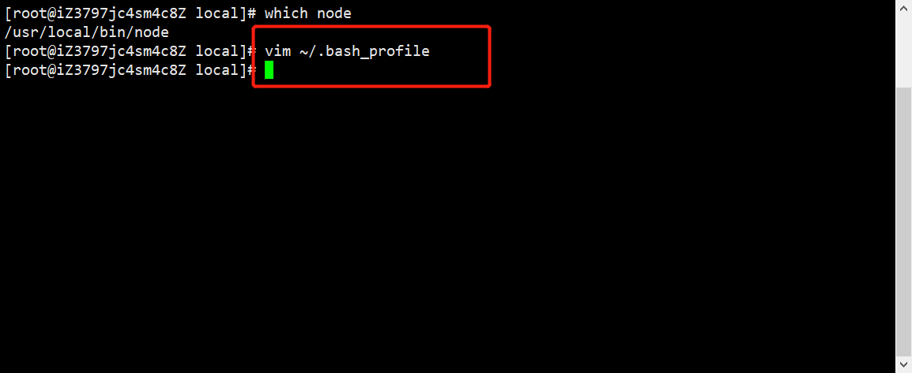

#### 执行source使修改生效

**source ~/.bash_profile**

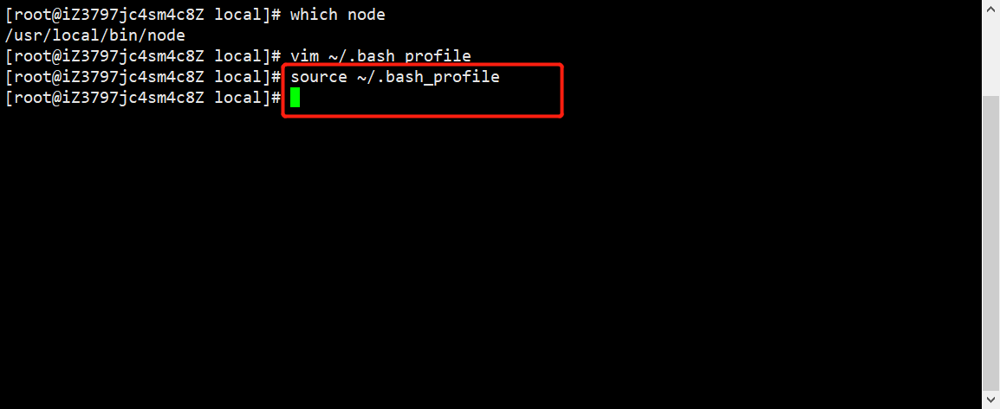

#### 再次输入node -v查看版本是否更新

##### **node -v**

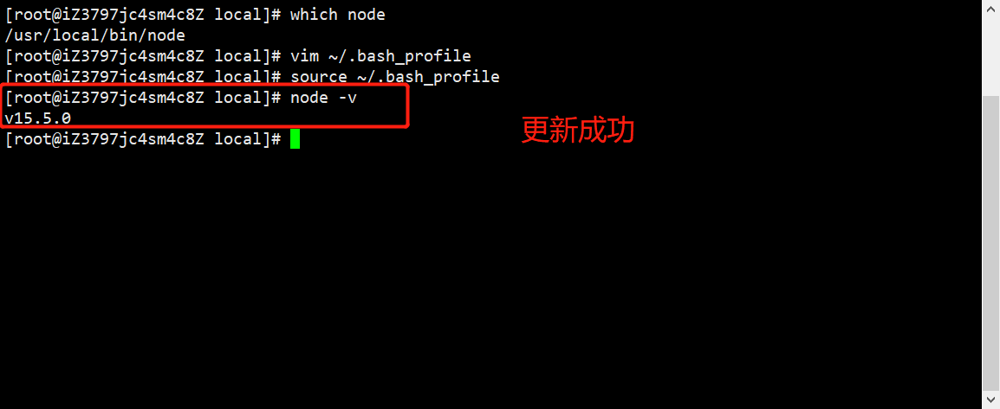