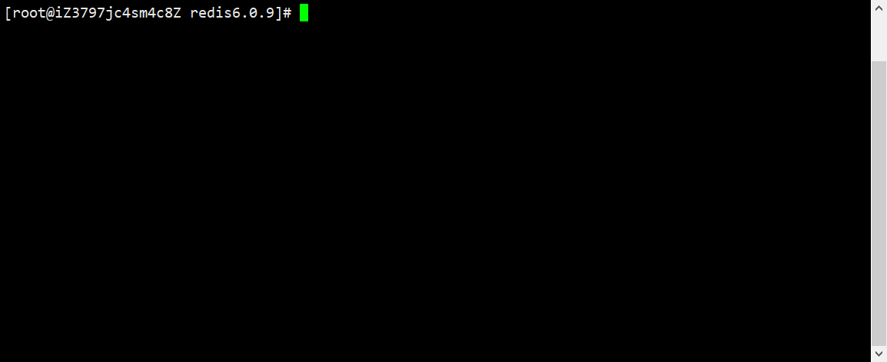
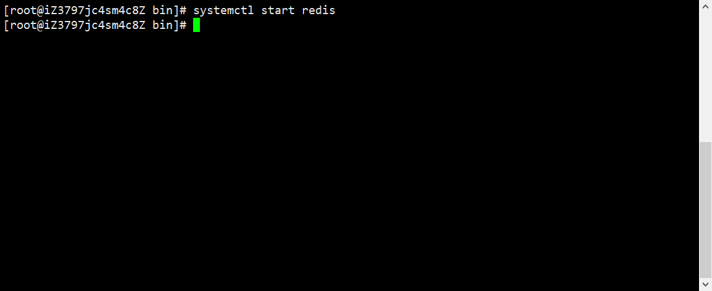

# Centos8装Redis6.0.9

## 1.搜索Redis的官网

### https://redis.io/download


## 2.找到Stable(6.0)[稳定版]

### (1)因为linux一般以tar.gz/tar.xz为压缩文件


### (2)右键->复制链接


## 3.打开Centos8服务器

### (1)打开/usr/local，新建redis6.0.9文件夹便于查看

#### mkdir redis6.0.9，cd redis6.0.9



### (2)使用wget下载复制的链接

#### wget https://download.redis.io/releases/redis-6.0.9.tar.gz?_ga=2.166403582.11592538.1608995554-1176621699.1608995554


### (3)下载完毕后文件夹结构


## 4.解压并安装

### (1)解压

#### tar -zxvf 'redis-6.0.9.tar.gz?_ga=2.166403582.11592538.1608995554-1176621699.1608995554'


### (2)检查是否安装GCC

#### gcc --version

#### 注意，gcc版本不宜过低


#### 如果没安装的可以执行下面命令

##### **yum -y install gcc**

### (3)安装redis

#### make PREFIX=/usr/local/soft/redis/redis-6.0.9 install


### (4)进入安装后的redis

#### cd /usr/local/soft/redis/redis-6.0.9


### (5)创建conf文件夹作为配置文件夹

#### mkdir conf


### (6)把源码目录下的redis.conf复制到安装目录

#### cp /usr/local/redis6.0.9/redis-6.0.9/redis.conf /usr/local/soft/redis/redis-6.0.9/conf/


### (7)创建redis运行目录

#### mkdir logs data

```html
logs:存放日志
data:存放快照数据
```


### (8)修改redis.conf文件

#### vi conf/redis.conf


```html
bind 0.0.0.0 /绑定访问的ip,注释 表示所有IP都可链接
daemonize yes //以daemon方式运行
logfile “/usr/local/soft/redis/redis-6.0.9/logs/redis.log” //日志保存目录
dir /usr/local/soft/redis/redis-6.0.9/data //数据保存目录
maxmemory 64MB //使用的最大内存数量
io-threads 1 //#io线程数，看你的服务器是几核的
```

#### 按/搜索对应的，N是下一个


#### 将需要修改的都修改完毕后，按`Tab`键底部出现输入框，输入`:wq`回车进行保存


### (9)生成供systemd使用的service文件

#### vi /lib/systemd/system/redis.service


#### 输入以下代码

```html
[Unit]
Description=Redis
After=network.target

[Service]
Type=forking
PIDFile=/var/run/redis_6379.pid
ExecStart=/usr/local/soft/redis/redis-6.0.9/bin/redis-server /usr/local/soft/redis/redis-6.0.9/conf/redis.conf
ExecReload=/bin/kill -s HUP $MAINPID
ExecStop=/bin/kill -s QUIT $MAINPID
PrivateTmp=true

[Install]
WantedBy=multi-user.target
```


#### 按`Tab`键底部出现输入框，输入`:wq`回车进行保存


#### 重新加载service文件

##### **systemctl daemon-reload**


## 5.测试启动

### (1)启动redis

#### systemctl start redis




## 6.修改redis密码

### (1)打开redis.cnf配置文件

#### vi /usr/local/soft/redis/redis-6.0.9/conf/redis.conf


### (2)搜索requirepass

#### requirepass 你的密码


#### 按`Tab`键底部出现输入框，输入`:wq`回车进行保存


### (3)重启redis

#### systemctl restart redis


## 7.使用redis-cli测试远程连接[服务器安全组需开放6379端口]

### (1)打开redis图形化编辑器，选择连接到Redis服务器


### (2)填写相关信息


### (3)提示连接成功


