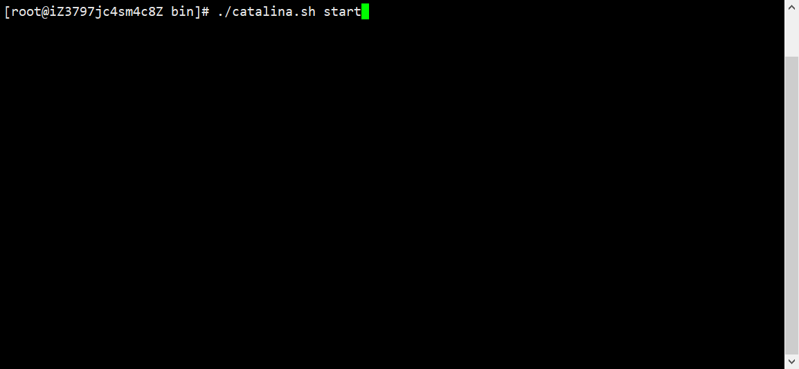

# Centos8装Tomcat9.0.41

## 1.搜索Tomcat的官网

### https://tomcat.apache.org/download-90.cgi

## 2.找到以tar.gz结尾的列表

### (1)因为linux一般以tar.gz/tar.xz为压缩文件

### (2)右键->复制链接

## 3.打开Centos8服务器

### (1)打开/usr/local，新建tomcat9.0.41文件夹便于查看

#### mkdir tomcat9.0.41，cd tomcat9.0.41

### (2)使用wget下载复制的链接

#### wget https://ftp.jaist.ac.jp/pub/apache/tomcat/tomcat-9/v9.0.41/bin/apache-tomcat-9.0.41.tar.gz

### (3)下载完毕后文件夹结构

## 4.解压并安装

### (1)解压

#### tar -zxvf apache-tomcat-9.0.41.tar.gz

## 5.测试是否安装成功

### (1)进入解压后tomcat9.0.41下的bin目录

### (2)启动tomcat

#### ./catalina.sh start

### (3)访问服务器公网IP:8080查看是否开启tomcat[安全组需开启8080端口]

### (4)关闭tomcat

#### ./catalina.sh stop

### ps:注意，这里的tomcat需要先安装JDK，不然会报找不到JAVA类库！！