# Centos8安装MongoDB4.4.2

## 1.搜索MongoDB的官网

### https://www.mongodb.com/try/download/community

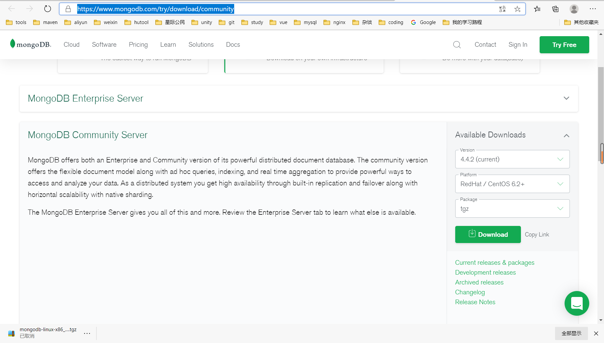

## 2.勾选RedHat/Centos8.0/tgz

### (1)因为linux一般以tar.gz/tar.xz为压缩文件

### (2)点击Download

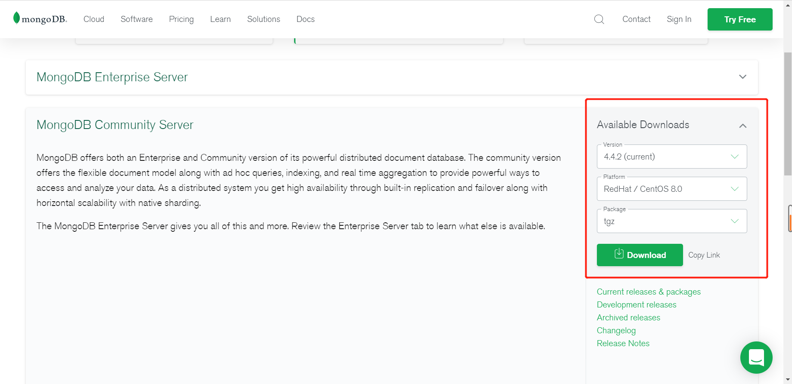

### (3)右键->复制链接

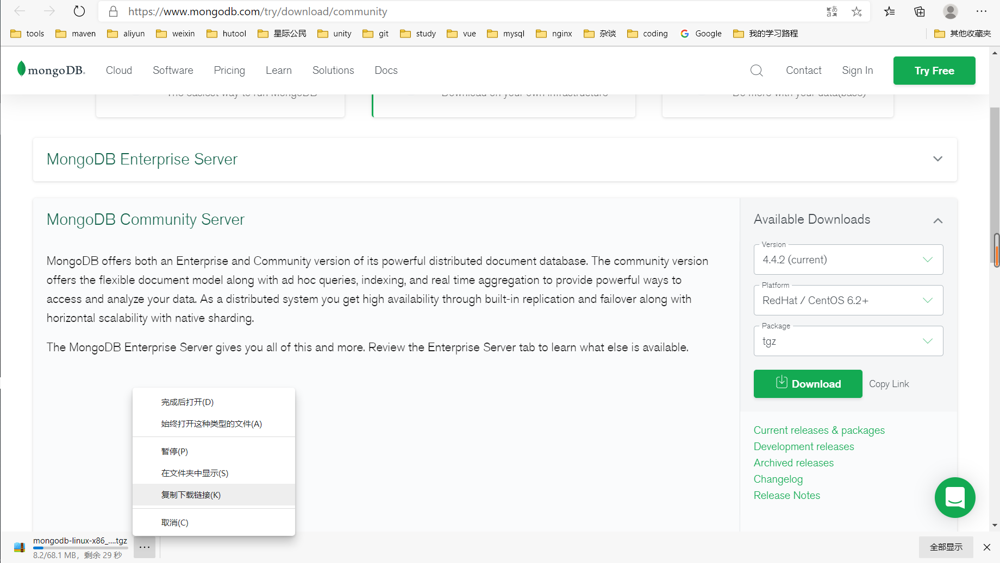

## 3.打开Centos服务器

### (1)打开/usr/local，新建mongoDB4.4.2文件夹便于查看

#### mkdir mongoDB4.4.2，cd mongoDB4.4.2

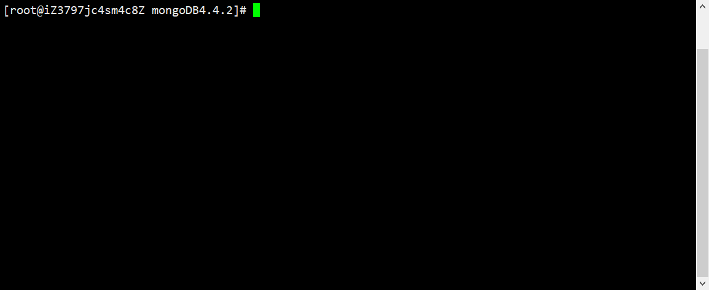

### (2)使用wget下载复制的链接

#### wget https://fastdl.mongodb.org/linux/mongodb-linux-x86_64-rhel80-4.4.2.tgz

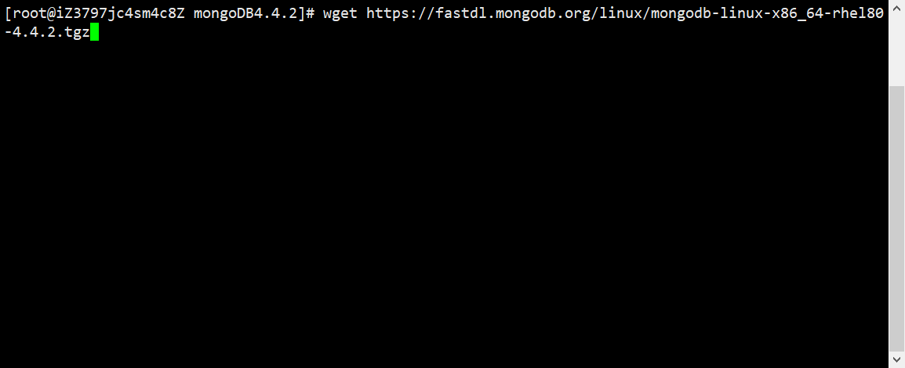

### (3)下载完毕后文件夹结构

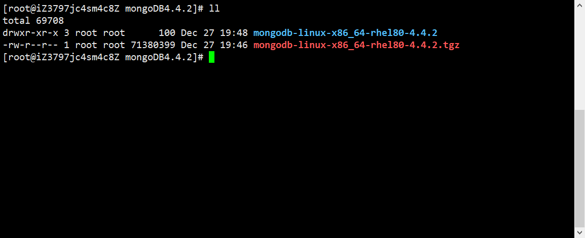

## 4.解压并安装

### (1)解压

#### tar -zxvf mongodb-linux-x86_64-rhel80-4.4.2.tgz

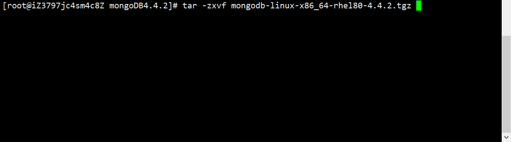


### (2)修改名字为mongodb-4.4.2

#### mv mongodb-linux-x86_64-rhel62-4.4.2 mongodb-4.4.2

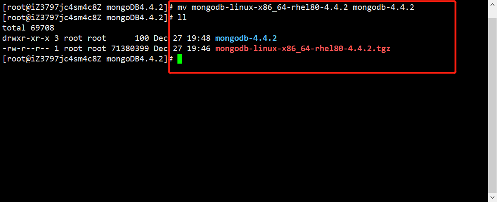

### (2)配置系统环境变量

#### vi /etc/profile

```html
#mongodb环境变量
export PATH=$PATH:/usr/local/mongoDB4.4.2/mongodb-4.4.2/bin
```


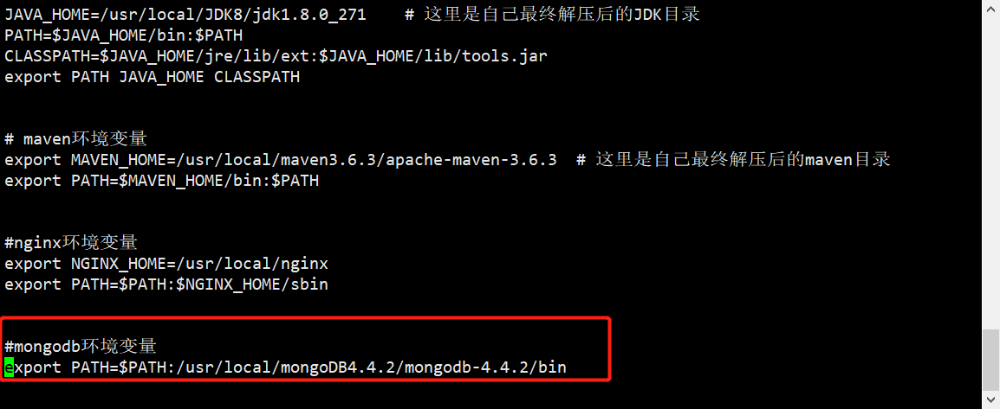

#### 按`Tab`键在底部输入框输入`:wq`或`:x`回车保存

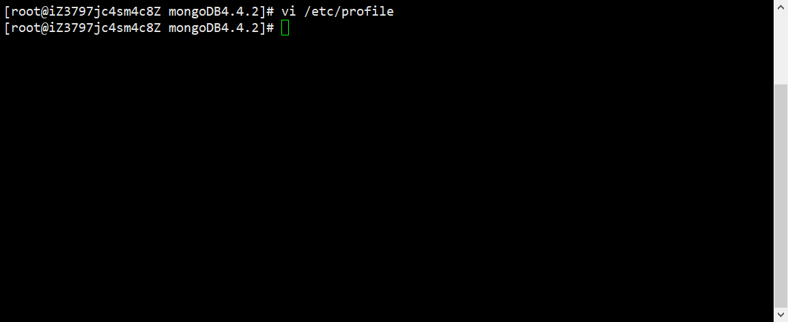

### (3)创建MongoDB数据存放文件夹和日志记录文件夹

#### mkdir -p /data/db

#### mkdir -p /logs

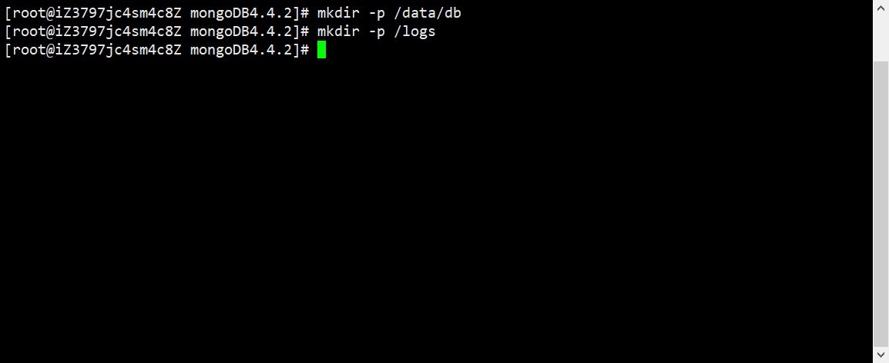

#### 进入bin目录下：cd /usr/local/mongoDB4.4.2/mongodb-4.4.2/bin

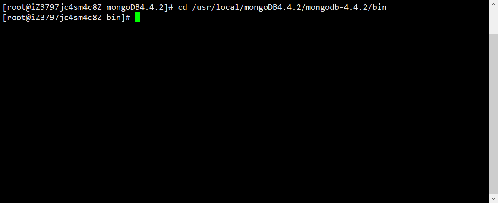

#### 创建mongodb.conf配置文件：vim mongodb.conf

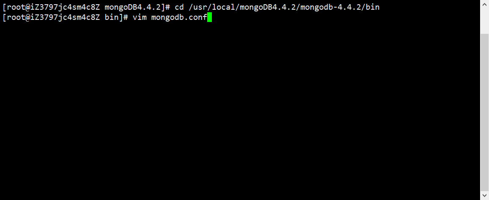

```html
dbpath = /data/db #数据文件存放目录
logpath = /logs/mongodb.log #日志文件存放目录
port = 27017 #端口
fork = true #以守护程序的方式启用，即在后台运行
#auth=true #需要认证。如果放开注释，就必须创建MongoDB的账号，使用账号与密码才可远程访问，第一次安装建议注释
bind_ip=0.0.0.0 #允许远程访问，或者直接注释，127.0.0.1是只允许本地访问
```

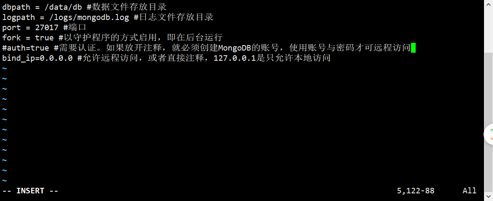

#### 最后“Esc”，输入“:wq”保存退出vim编辑模式即可。

## 5.启动MongoDB

### (1)进入bin目录下，加载配置文件方式启动：

#### 	cd /usr/local/mongoDB4.4.2/mongodb-4.4.2/bin

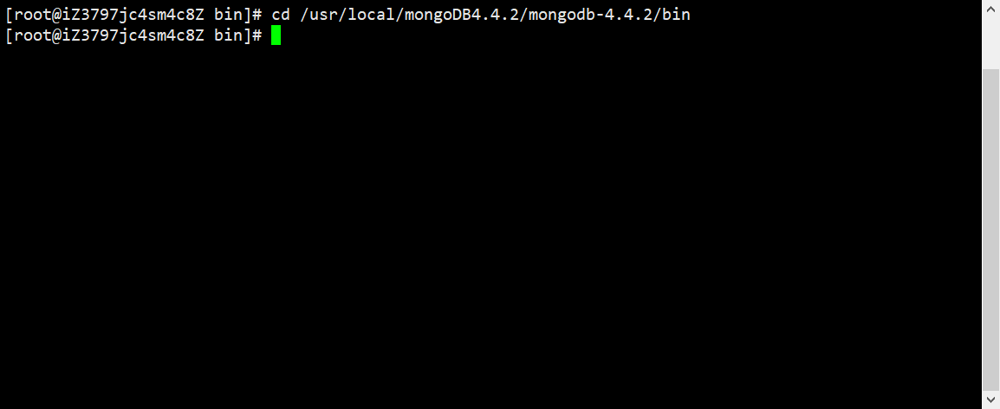

#### ./mongod  -f  mongodb.conf

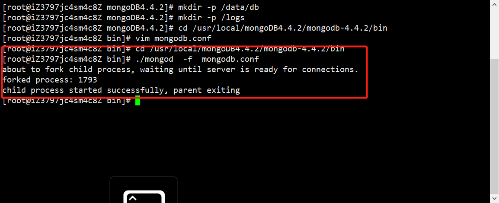

## 6.修改MongoDB密码

### (1)连接mongodb

#### mongo

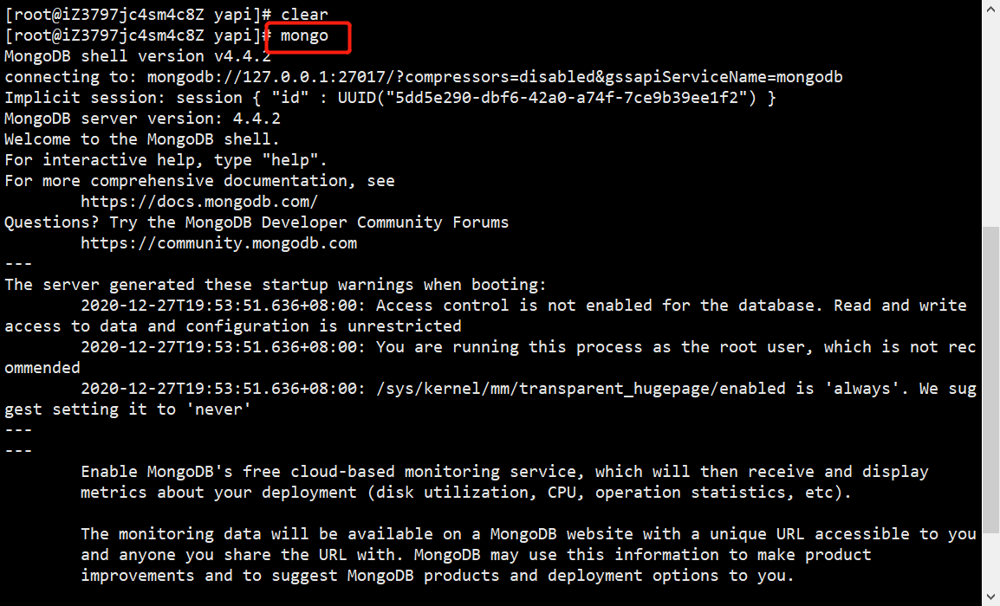

### (2)与管理数据库连接。

#### use admin;

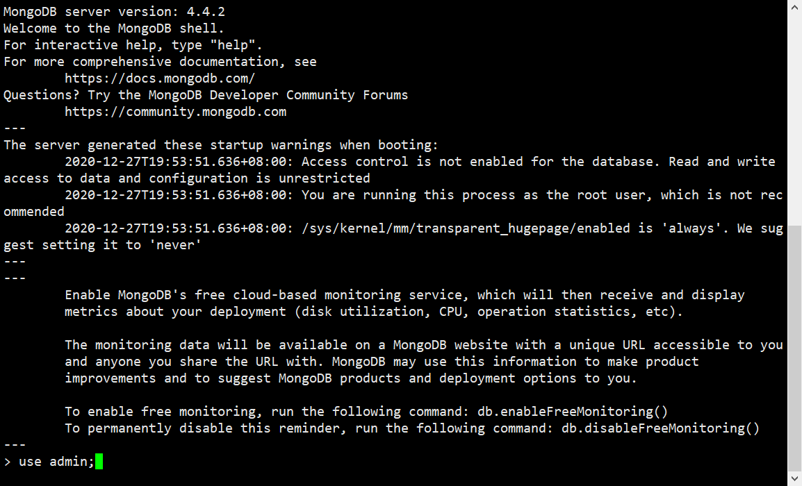

#### db.createUser({user:"账号",pwd:"密码",roles:[  {role:"clusterAdmin", db:"admin" } ]});

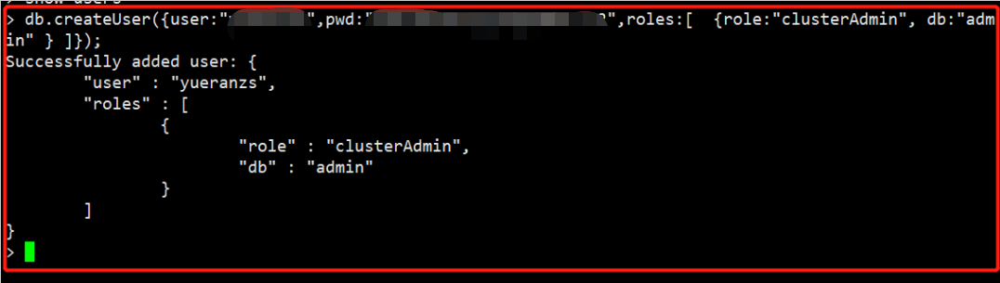

#### 输入：show users;查看是否创建成功

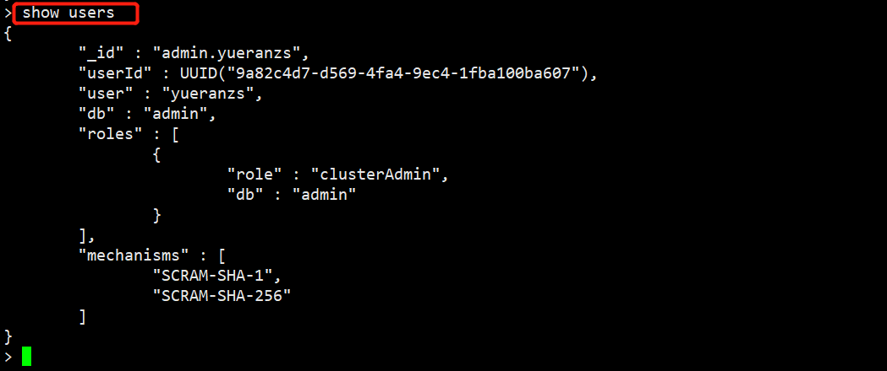